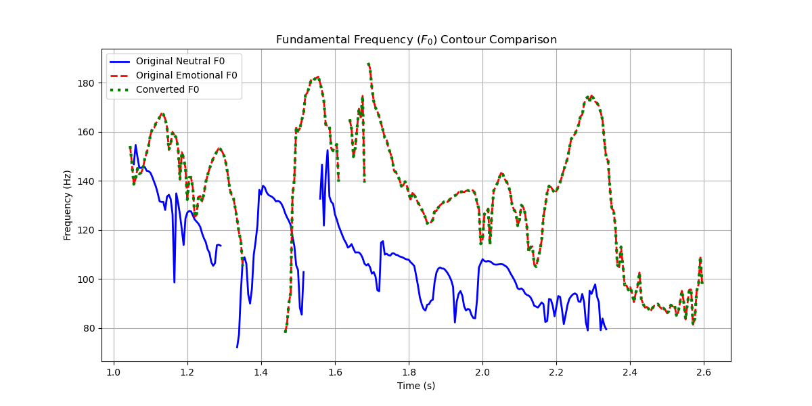

# Emotional Prosody Transfer using WORLD Vocoder

This project demonstrates **emotional prosody transfer** using the [WORLD vocoder](https://github.com/mmorise/World).  
The idea is to take a **neutral speech signal** and modify its **pitch contour (F0)** using an **emotional reference**, while keeping the spectral envelope and aperiodicity neutral. This results in a speech signal that carries the emotional tone of the reference speaker while preserving the content of the neutral audio.

---

## 🛠️ How it Works

1. **Audio Preprocessing**
   - Load emotional (`emotion.wav`) and neutral (`neutral.wav`) speech.
   - Resample to a consistent sampling rate (e.g., 22050 Hz).

2. **WORLD Vocoder Analysis**
   WORLD decomposes speech into three components:
   - **F0 (Fundamental Frequency):** Represents pitch.
   - **Spectral Envelope (SP):** Represents vocal tract characteristics.
   - **Aperiodicity (AP):** Represents noise/unvoiced parts.

3. **Prosody Transfer**
   - Replace the **neutral F0 contour** with the **emotional F0 contour**.
   - Keep **SP** and **AP** from the neutral speech.

4. **Synthesis**
   - Reconstruct speech using WORLD synthesis (`pw.synthesize`).

5. **Visualization**
   - Plot F0 contours to compare original neutral, emotional, and converted signals.

---

## 📊 Results

You can place your generated results here:

- **Converted Audio Output:** [`converted.wav`](./converted.wav)  
- **F0 Comparison Plot:**   


## 🌍 About the WORLD Vocoder

### Algorithm
- **DIO**: Extracts the F0 contour (fundamental frequency).
- **StoneMask**: Refines F0 for better accuracy.
- **CheapTrick**: Estimates the spectral envelope.
- **D4C**: Estimates aperiodicity.

### Advantages
- ✅ High-quality speech reconstruction.  
- ✅ Precise control over F0, SP, and AP independently.  
- ✅ Lightweight and fast, suitable for signal-processing research.  
- ✅ Widely used as a baseline in speech synthesis research.  

### Disadvantages
- ❌ Speech sounds somewhat **robotic** if only F0 is modified.  
- ❌ Limited ability to capture **subtle emotional nuances** (energy, timbre).  
- ❌ Performance degrades with noisy or long recordings.  
- ❌ Cross-speaker emotion transfer can sound unnatural without extra processing.  

---

## 🔮 Future Directions: Deep Learning

While WORLD is powerful, **modern speech emotion transfer** is moving toward **deep learning** methods:

- **Autoencoders / VAEs**: Learn latent speech representations.  
- **GANs (Generative Adversarial Networks)**: Improve naturalness of converted speech.  
- **Sequence-to-Sequence Models (Tacotron, VITS, FastSpeech)**: End-to-end speech synthesis with emotional style transfer.  
- **Self-Supervised Models (HuBERT, wav2vec 2.0)**: Capture richer prosodic and linguistic information.  

➡️ The future of emotional speech conversion lies in **deep generative models** that can learn emotion directly from data, producing much more natural and expressive results compared to vocoder-based methods.

---

## 🚀 Usage

Run the code:

```bash
python emotional_prosody_transfer.py
